<p>
  
  <span style="font-size:1.6em;font-weight:700;line-height:1;">LGA TOOL PACK</span><br>
  <span style="font-style:italic;line-height:1;">Lega | v2.44</span>
</p>
<br clear="left">


## Instalación

- Copiar la carpeta **LGA_ToolPack** que contiene todos los
  archivos **.py** a **%USERPROFILE%/.nuke**.

- Con un editor de texto, agregar esta línea de código al archivo
  **init.py** que está dentro de la carpeta **.nuke**:

  ```
  nuke.pluginAddPath('./LGA_ToolPack')
  ```

- El ToolPack permite **activar/desactivar** herramientas sin tocar
  código editando el archivo **\_LGA_ToolPack_Enabled.ini**
  (dentro de **LGA_ToolPack**/).\
  Por defecto todas las herramientas están en **True**. Cambiar a
  **False** las oculta y evita cargar su script.\
  Para conservar la configuración en futuras actualizaciones, se puede
  copiar el archivo a **\~/.nuke/\_LGA_ToolPack_Enabled.ini**. Si
  existen ambos, tiene prioridad el de **\~/.nuke/.**

<br><br>


## READ n WRITE


##  Media manager v1.6 - Lega | *Alt + M*

Para verificar que toda la media usada en el script esté guardada en la ubicación correcta, y si no lo está copiarla a donde corresponda.

Escanea la media de la carpeta del shot y de los nodos Read del proyecto, permitiendo visualizar la ubicación de todos los archivos y organizarlos de manera rápida. La clasifica en estados como OK, Offline, Outside, y Unused para ayudar a decidir las acciones necesarias

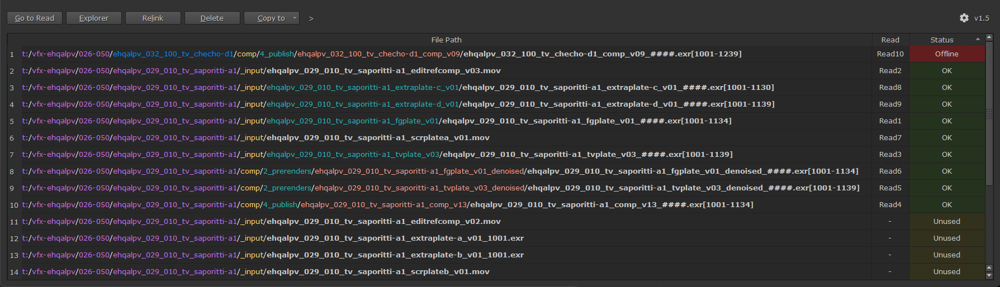


**Funciones**

- Go to read: Muestra en el node graph el read que contiene a la media seleccionada.
- Explorer: Abre la media en Windows Explorer.
- Relink: Abre una ventana para elegir una ubicación para buscar un archivo que está marcado como offline. Busca en las carpeta y subcarpetas hasta encontrar un match, y cambia la ruta del Read por la ruta encontrada.
- Delete: Borra los archivos seleccionados. Funciona con selección múltiple de filas.
- Copy to: Copia la media seleccionada a el destino elegido y cambia la ruta del Read por la ruta donde fue copiado. Esta función sólo se habilita para archivos marcados como Outside.


**Opciones disponibles en los Settings**

- Shot folder depth: Determina cuántos niveles de carpetas se deben retroceder desde la carpeta donde está ubicado el script (proyecto) hasta la carpeta principal del shot. Si por ejemplo el shot está en T:/Client/Film/Shot/Comp/Project/e101s005.nk entonces para retroceder hasta el Shot folder tenemos que retroceder 3 niveles desde Project (1), Comp (2), Shot (3).
- Copy to: Determina las carpetas para el menú “Copy to”. El Name es el que aparecerá en el menú. Usando el signo & se agrega un shortcut para esa acción. La ruta se comienza a formar desde la carpeta del shot.
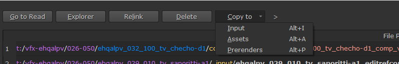


<br><br>

##  Media path replacer v1.6 - Lega | *Ctrl + Alt + M*

Para cuando hay missing media porque se cambió la ubicación del proyecto y su media.

Permite buscar y reemplazar rutas en los nodos Read y Write. Da la opción de filtrar listas, incluir sólo nodos Read o Write, y tiene un sistema de presets para guardar y cargar configuraciones frecuentes.

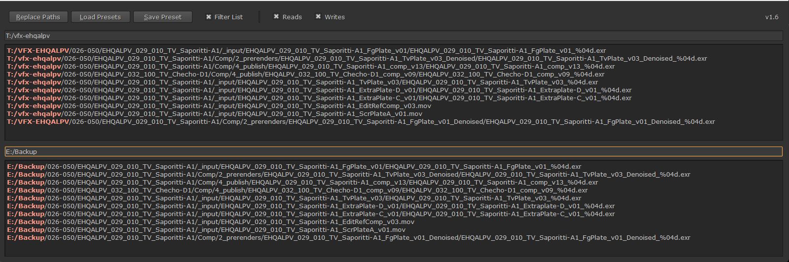

Útil para actualizar rutas de archivos cuando se mueven proyectos a otras carpetas o discos.


<br><br>

##  CopyCat Cleaner v1.0 - Lega

Analiza todos los nodos Inference del script, compara el modelo .cat usado con el más reciente disponible en su carpeta y permite limpiar versiones antiguas junto con sus imágenes de entrenamiento.

Muestra los resultados en una tabla con estado (Match / Outdated / Missing) y un botón Clean para mover los archivos no usados a una carpeta “clean” paralela.

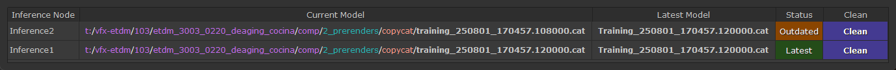


<br><br>

##  Read from Write v2.3 - Fredrik Averpil | *Shift + R*

[https://www.nukepedia.com/python/misc/readfromwrite](https://www.nukepedia.com/python/misc/readfromwrite)

Genera un nodo Read a partir de la ruta y archivo del nodo Write seleccionado.


<br><br>

##  Write Presets v1.9 - Lega | *Shift + W*

Para crear nodos Write con configuraciones predefinidas para diferentes tipos de render.

Abre una ventana con opciones de render pre configuradas que se cargan desde un archivo .ini. Permite crear Writes basados en el nombre del script o en el nombre del nodo Read más alto. Según la configuración, puede abrir un diálogo para nombrar el render y crear automáticamente un backdrop con Write y Switch. Los presets incluyen configuraciones específicas para diferentes formatos (mov, tiff, exr) con parámetros optimizados para cada caso.


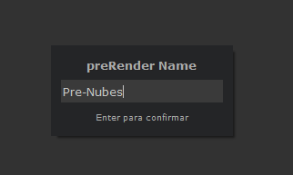

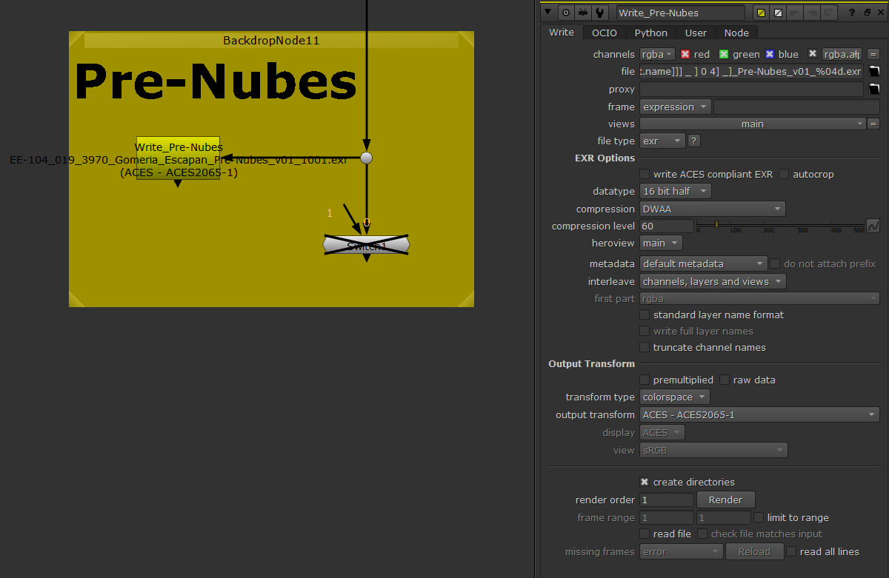


También incluye un botón para poder previsualizar un path TCL como una ruta absoluta, seleccionando primero el nodo Write a inspeccionar:

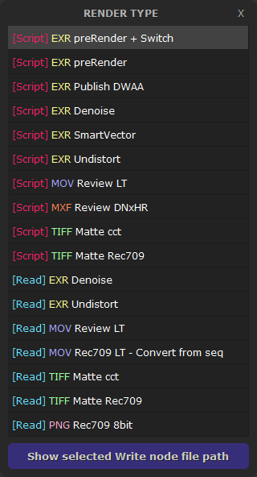

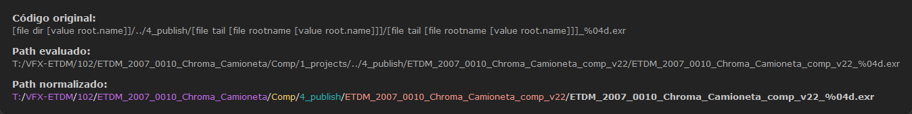


<br><br>

##  Write focus v1.0 - Lega | *Ctrl + Alt + Shift + W*

Para ir rápidamente al nodo Wirte principal.

Busca un nodo Write con un nombre definido en los settings del ToolPack, lo pone en foco y lo abre en el panel de propiedades.


<br><br>

##  Write send mail v1.0 - Lega | *Ctrl + Shift + W*

Útil para renders largos, permite mandar un mail cuando termina el render.

Agrega a los nodos Write seleccionados un checkbox para enviar mail. También lo agrega a cualquier nuevo nodo Write creado desde que está instalado este script.

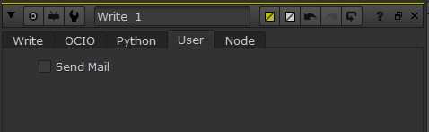

La información para enviar el mail se debe completar en los settings del ToolPack.

Funciona en conjunto con la herramienta Render Complete (a continuación).


<br><br>

##  Render complete v1.1 - Lega

Ejecuta las acciones siguientes cuando termina el render:

- Reproduce un sonido por defecto es un wav llamado LGA_Render_Complete.wav que está dentro de la carpeta LGA_ToolPack. Puede ser reemplazado por cualquier otro wav o deshabilitado desde los settings del ToolPack
- Calcula la duración al finalizar el render y la agrega en un knob con esa información en el tab User del nodo Write.
- Envía un email con los detalles del render si se ha creado un checkbox usando la herramienta Write send mail y si ese checkbox está activado.


<br><br>

##  Show in Explorer v1.0 - Lega | *Shift + E*

Revela la ubicación del archivo de un nodo Read o Write seleccionado en el Explorador de Windows. Si no hay ningún nodo seleccionado, revela la ubicación del script/proyecto actual.


<br><br>

##  Show in Flow v2.0 - 2024 - Lega | *Ctrl + Shift + E*

Abre la URL, revela en el internet browser la ubicación de la task comp del shot que pertenece al script/proyecto actual. Se puede elegir si hacerlo desde el browser por defecto o desde uno específico.

Para el login completar la información en los settings del ToolPack.


<br><br>

##  RnW ColorSpace favs v1.1 - Lega | *Shift + C*

Para cambiar rapidamente el espacio de color de un Read, Write, etc.

Abre una ventana con una lista de espacios de color que se pueden aplicar sobre todos los nodos Read y/o Write seleccionados.

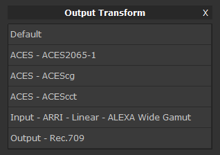


Esta lista se puede editar en los settings del ToolPack.


<br><br>

## <span style="color:#135eab;">FRAME RANGE</span>

##  Frame range | Read to Project v1.0 - Lega | *Shift + F*

Útil para cuando se empieza un proyecto nuevo y se quiere usar el frame range de un nodo Read en los settings del proyecto.


<br><br>

##  Frame range | Read to Project (+Res) v1.0 - Lega | *Ctrl + Shift + F*

Igual que el anterior, pero además de copiar el frame range del Read, también se copia la resolución a los settings del proyecto.


<br><br>

## <span style="color:#914dcb;">ROTATE TRANSFORM</span>

##  Rotate Transform v1.0 - Lega

Cambia los valores de rotación de los nodos Transform seleccionados.


Shortcuts (usando las teclas / y * del teclado numérico):

- Ctrl + * gira 0.1 grados hacia la derecha
- Ctrl + shift + * gira 0.1 grados hacia la derecha
- Ctrl + / gira 0.1 grados hacia la izquierda
- Ctrl + shift + / gira 0.1 grados hacia la izquierda


<br><br>

## <span style="color:#cb944d;">NODE BUILDS</span>

Esta sección es para armar setups de nodos que se usan repetidamente usando shortcuts.

Similar al uso de toolSets, pero más ágil y con más posibilidades.


##  Build Iteration v1.1 - Lega | *Shift + i*

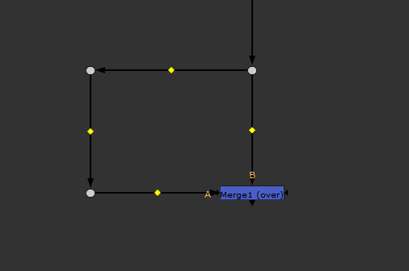


<br><br>

##  Build Roto Blur in mask input v1.1 - Lega | *Shift + O*

Agrega un nodo Roto y un Blur en el input mask del nodo seleccionado.

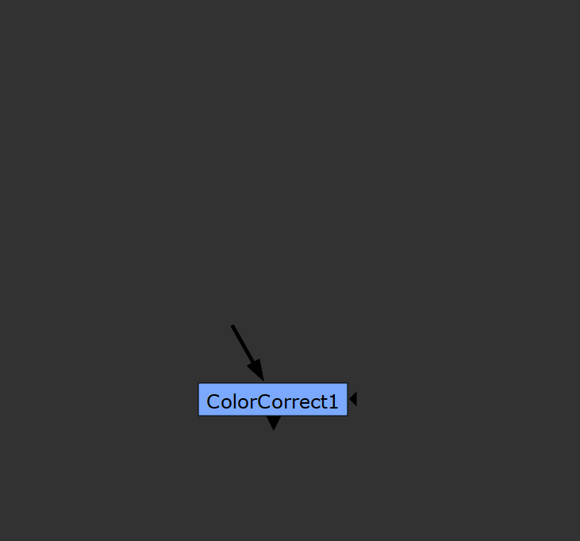

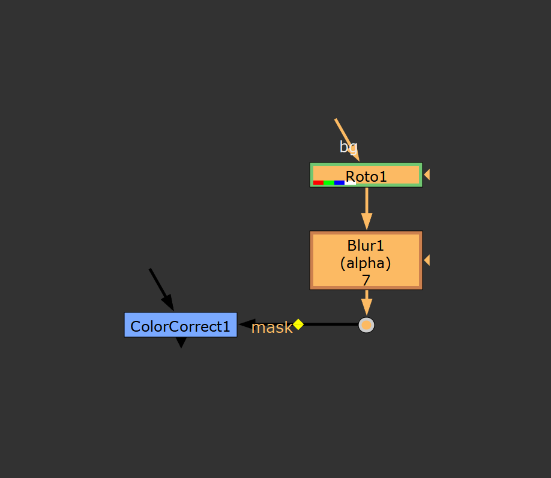


<br><br>

##  Build Merge | Switch Merge operations v1.31 - Lega | *Shift + M*

Si NO hay un nodo Merge seleccionado, crea un nodo Merge con operación en Mask y bbx en ‘A’, y en el input A suma un nodo Roto y un Blur.

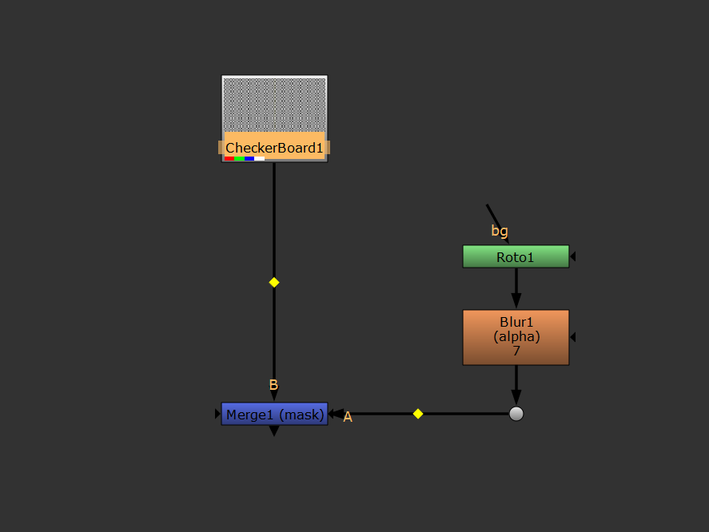

Si en cambio se ejecuta con un nodo Merge seleccionado, cambia sus operaciones y va rotando entre 'over' con bbox 'B', 'mask' con bbox 'A' y 'stencil' con bbox 'B'.


<br><br>

##  Build Grade v1.1 - Lega | *Shift + G*

Crea un nodo Grade y en el input Mask suma un nodo Roto y un Blur.

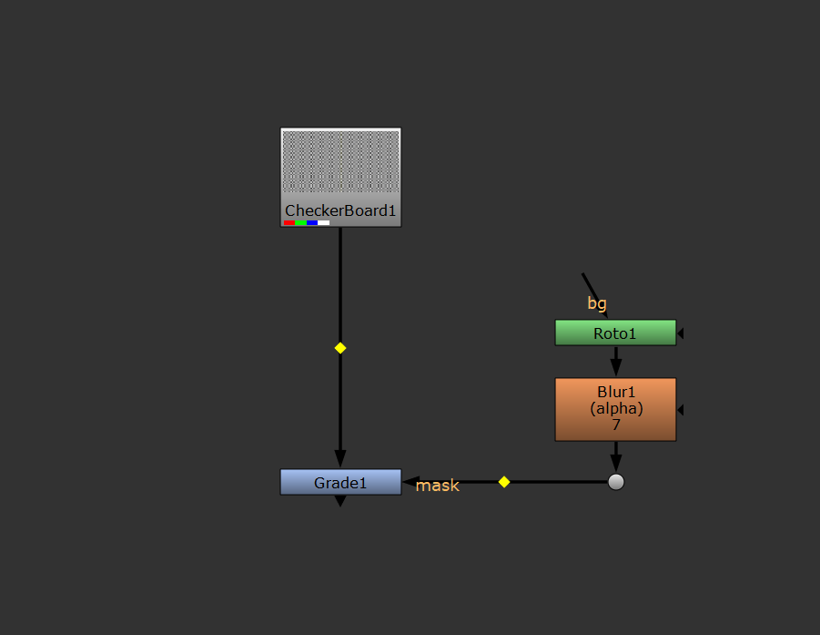


<br><br>

##  Build Grade Highlights v1.1 - Lega | *Ctrl + Shift + G*

Crea un nodo Grade y en el input Mask suma un nodo Keyer que sale de la rama del grade y un Shuffle para poder evaluar el canal alpha con el viewer en RGB.

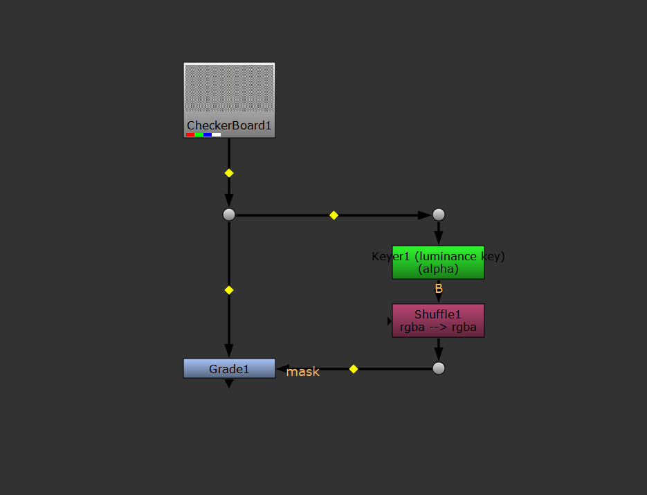


<br><br>

## <span style="color:#cb944d;">KNOBS</span>


##  Channels Cycle v1.1 - Lega | *Ctrl + Shift + A*

Cambia el valor del knob 'channels' de un nodo seleccionado. Rota el valor entre 'rgb', 'alpha' y 'rgba'.

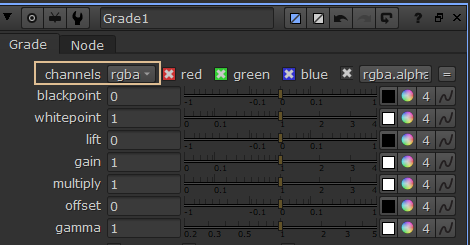

<br><br>

##  Disable A/B v1.0 - Lega | *Shift + D*

Útil para comparar rápidamente dos grupos de nodos (grupo A vs grupo B) o dos nodos iguales con distintos valores.

Crea un nodo que, al habilitarlo o deshabilitarlo (shortcut D), actúa como un switch global entre un grupo y otro.

Ideal para comparar, por ejemplo, dos Grades, o un blur vs un defocus, o también para crear un master switch que deshabilite nodos pesados durante el trabajo y se puedan volver a habilitar desde un solo nodo antes del render.


**Modo de uso**

Seleccionar todos los nodos que pertenecerán a ambos grupos y ejecutar la herramienta (Shift+D)

Abre una ventana que muestra una lista con todos los nodos seleccionados, usando el color de cada uno, y permite seleccionar si pertenecen al grupo A o grupo B.

Luego linkea el knob Disable de los nodos seleccionados a un nodo master llamado Disable_A_B para facilitar el cambio de un grupo a otro.

Una vez creado el grupo, si se ejecuta Shift+D seleccionado en nodo master Disable_A_B se desconectarán y volverá todo a su estado inicial.

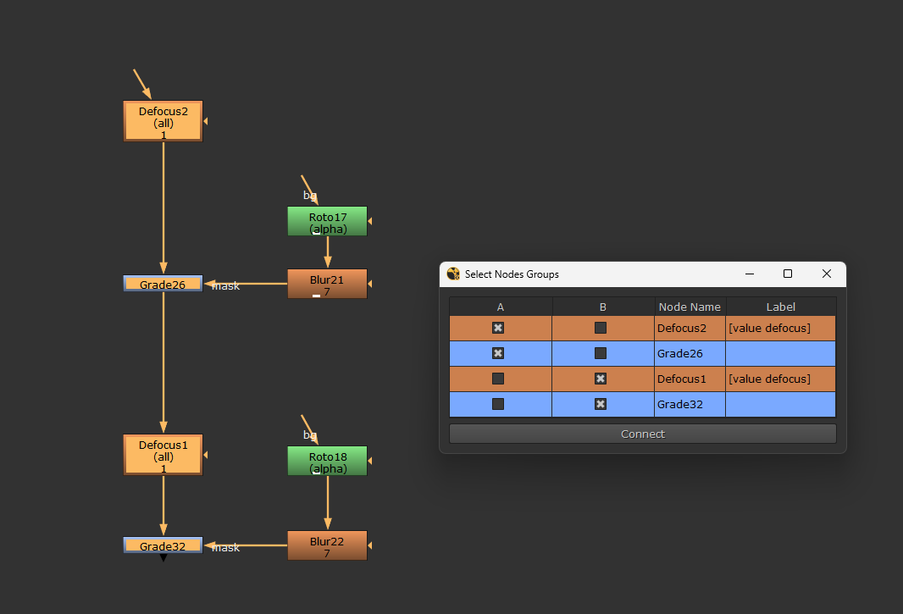

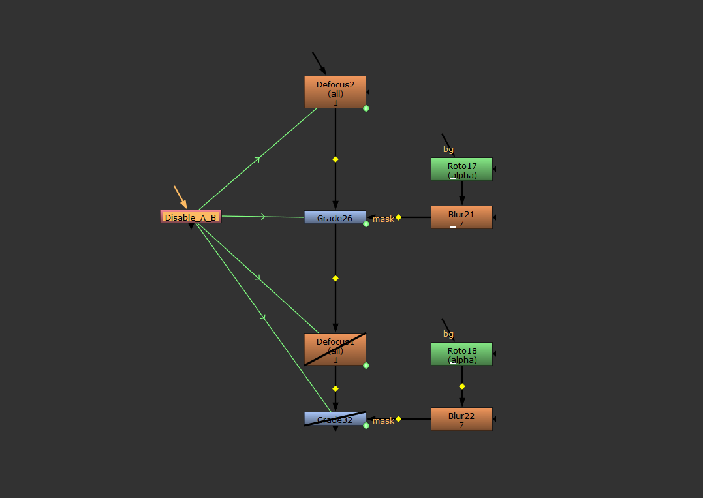


<br><br>

##  Channel Hotbox v2.0 - Falk Hofmann

[http://www.nukepedia.com/python/ui/channel-hotbox](http://www.nukepedia.com/python/ui/channel-hotbox)

Abre una GUI que permite cambiar fácilmente los canales actualmente disponibles del viewer (rgba, depth, motion, AOVs, etc, evitando el menú desplegable, page up/down.

También permite mostrar, shufflear o aplicar un grade a los canales disponibles en el nodo al que está conectado el Viewer actual.

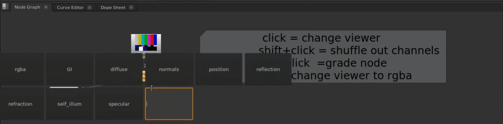


**Shortcuts**

Shift + H Abre la GUI


Shortcuts con la GUI abierta:

- Click Cambia el visor al canal seleccionado.
- Shift+Click Shufflea todos los canales seleccionados.
- Ctrl+Click Crea un nodo Grade con el canal configurado al seleccionado.
- Alt Cambia el visor de vuelta a RGBA.
<br><br>

## <span style="color:#cb4d82;">VA</span>

##  Viewer Rec709 v1.0 - Lega | *Shift + V*

Cambia el viewer a Rec709.


<br><br>

##  Take/Show Snapshot v1.0 - Lega | *Shift + F9 [take] / F9 [show]*

Take: Toma un snapshot (jpg), lo guarda en la carpeta de archivos temporales, y también lo guarda en una galería.

Show: Muestra el último snapshot tomado, el de la carpeta de archivos temporales.

Además de los shortcuts en el menú, también se agregan estos botones al viewer:

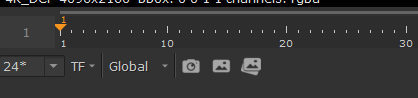

El último botón abre una galería con todos los snapshots que se guardan, separados por proyecto:

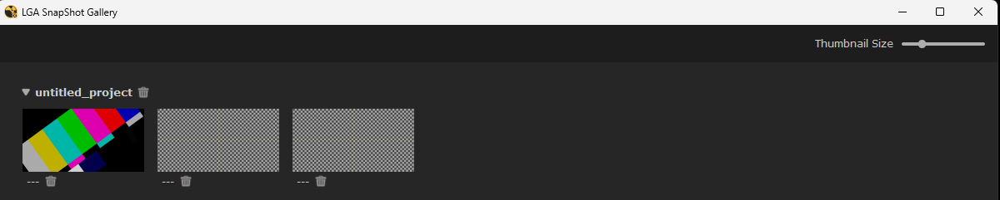


<br><br>

##  Reset workspace v1.0 - Checho | *Ctrl + Alt + W*

Reinicia el workspace.


<br><br>

##  Restart NukeX v1.12 - Lega | *Ctrl + Alt + Shift + Q*

Reinicia NukeX. Antes de hacerlo espera a que se guarde o no el proyecto actual, busca cual es la versión actual de Nuke abierta y lo reinicia usando la misma consola que se estaba usando.

Útil cuando borrar la caché no es suficiente para que Nuke vuelva a funcionar correctamente y es necesario cerrarlo y volver a abrirlo.
