<p>
  
  <span style="font-size:1.6em;font-weight:700;line-height:1;">LGA TOOL PACK</span><br>
  <span style="font-style:italic;line-height:1;">Lega | v2.63</span><br>
</p>
<br clear="left">

## Instalación

- Copiar la carpeta **LGA_ToolPack** que contiene todos los archivos del ToolPack a **%USERPROFILE%/.nuke**.<br> Debería quedar así:
   ```
   .nuke/
   └─ LGA_ToolPack/
      ├─ menu.py
      ├─ py/
      └─ ...
  ```

- Con un editor de texto, agregar esta línea de código al archivo
  **init.py** que está dentro de la carpeta **.nuke**:

  ```
  nuke.pluginAddPath('./LGA_ToolPack')
  ```

- El pack permite **activar/desactivar** herramientas desde el menú **TP > Enable Tools**, que se explica acá abajo.

<br>


## Enable Tools v1.06 | Lega

Para elegir qué herramientas del pack aparecen en el menú.<br>
Se abre desde **TP > Enable Tools** y muestra una casilla por herramienta, agrupadas igual que el menú. La que se destilda se oculta del menú y además **no se carga**, así que apagar lo que no se usa también le saca trabajo al arranque de Nuke. Los cambios se aplican al reiniciar Nuke.<br>
La elección se guarda **fuera del pack**, en **%APPDATA%\LGA\ToolPack\Enabled.ini** (Windows) o **~/Library/Application Support/LGA/ToolPack/Enabled.ini** (macOS), así que actualizar el pack no la pisa. El path del archivo se muestra abajo de todo y se puede clickear para abrirlo en el explorador de archivos.<br>
**All On** y **All Off** tildan y destildan todo; **Reset** vuelve a los valores de fábrica, que igual hay que guardar con **Save**.

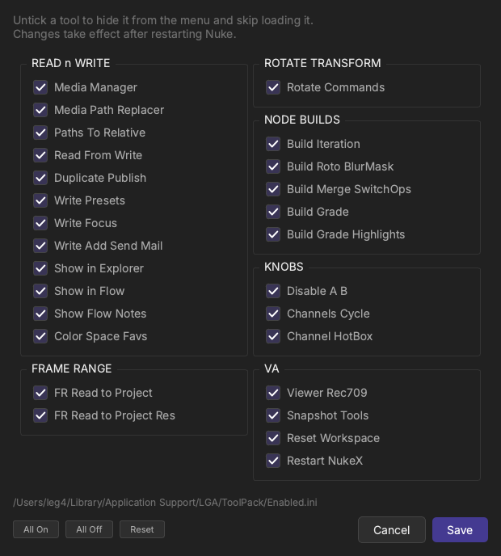

<br>


<br><br>


##  Media manager v2.46 | Lega

Para revisar y ordenar toda la media del proyecto de forma rápida.<br>
Al ejecutarlo escanea las carpetas configuradas como scan locations y todas las rutas de los nodos Read del script, mostrando el estado de cada archivo como OK, Offline, Outside o Unused para poder decidir si relinkear, copiar o borrar.<br><br>


**Funciones**
- <strong>Go to read:</strong> (Alt+G) Muestra en el node graph el read que contiene a la media seleccionada.
- <strong>Reveal:</strong> (Alt+R) Abre la carpeta de la media con el explorador de archivos del sistema.
- <strong>Relink:</strong> (Alt+L) Abre una ventana para elegir una ubicación para buscar un archivo que está marcado como offline. Busca en las carpeta y subcarpetas hasta encontrar un match, y cambia la ruta del Read por la ruta encontrada.
- <strong>Copy to:</strong> (Alt+C) Copia la media seleccionada al destino elegido y cambia la ruta del Read por la ruta donde fue copiado. Sólo se habilita para archivos marcados como Outside. Los destinos del menú son las locations que tengan tildado <em>Copy to</em> en los Settings, en ese orden, y cada una se dispara con Alt + la letra de su atajo. Si la ruta de un destino tiene comodín y resuelve a ninguna carpeta o a varias, avisa y no copia: elegir una sería adivinar.
- <strong>Download:</strong> (Alt+D) Pide a Wasabi el archivo o la secuencia de cada fila seleccionada: la misma ruta que muestra la fila, sin buscar versiones más altas. Lo hace a través de FileManager S3 o, si no está instalado, de PipeSync, que acepta el mismo comando; el botón aparece sólo si hay alguna de las dos. La descarga se sigue desde el Activity tab de esa app, y al terminar un Rescan actualiza la tabla.
- <strong>Delete:</strong> (Alt+Backspace) Manda los archivos seleccionados a la papelera. Funciona con selección múltiple de filas.
<br><br>

**Opciones disponibles en los Settings**

- <strong>Shot folder:</strong> La carpeta principal del shot, escrita como una ruta relativa a la carpeta del script. Define qué está adentro del shot y qué está afuera, o sea de dónde sale el estado Outside, y es el ancla del coloreo de los paths. Por default es <code>../..</code>: si el script está en T:/Client/Film/Shot/Comp/Project/e101s005.nk, sube desde Project a Comp y de Comp a Shot. Se puede apagar, y ahí Outside pasa a medirse contra las scan locations.
- <strong>Scan locations:</strong> Una fila por carpeta, con su nombre y su ruta relativa al script. La ruta acepta <code>*</code> como comodín, así que <code>../*assets*</code> encuentra 0_assets, _assets o my_assets sin tener que escribir el nombre exacto, y la columna <em>Resolves to</em> muestra a qué carpeta real llega cada una. Cada fila tiene dos casillas: <strong>Scan</strong> la incluye en el escaneo —si otra location ya la contiene queda tildada y deshabilitada, porque el escaneo es recursivo— y <strong>Copy to</strong> la ofrece en el menú de copia. El atajo va en su propio campo, una sola letra, y se dispara con Alt + esa letra.
- <strong>Theme y Table font size:</strong> La paleta de las dos ventanas y el tamaño de letra de las tablas. Los dos se ven aplicados mientras se eligen, y Cancel los revierte.
<br><br>

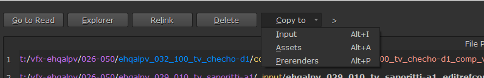
<br><br>


<br>


##  Media path replacer v2.03 | Lega

Para cuando hay missing media porque se cambió la ubicación del proyecto y su media.<br>
Permite buscar y reemplazar rutas en los nodos Read y Write. Incluye preview en filas dobles (Original/New) con identificación visual por tipo de nodo, dos etapas de Search & Replace y presets integrados.<br>
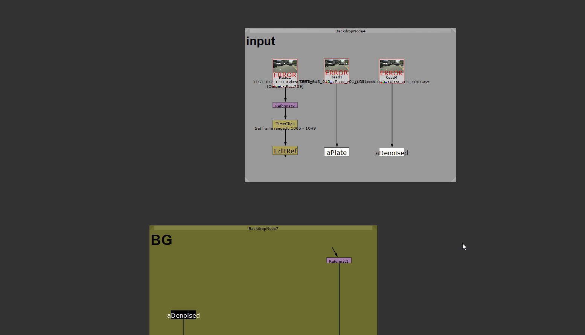<br>
Útil para actualizar rutas de archivos cuando se mueven proyectos a otras carpetas o discos.
<br><br>


<br>


##  Paths to Relative v1.0 | Lega

Para que el proyecto sobreviva a un cambio de disco o de ubicación.<br>
Convierte a rutas relativas las rutas absolutas de los nodos que apuntan a archivos: Read, Write, DeepRead, DeepWrite, ReadGeo, WriteGeo, Precomp, Vectorfield y OCIOFileTransform, incluyendo el knob `proxy`.<br>
Las rutas se calculan contra el **Project Directory** de Project Settings, que es contra lo que Nuke resuelve los paths relativos. Ojo con esto: no los resuelve contra la ubicación del `.nk`. Si ese campo está vacío las rutas relativas no funcionan, así que la ventana ofrece dejarlo en `[python {nuke.script_directory()}]`, la misma expresión que pone el botón Script Directory.<br>
Si hay nodos seleccionados actúa sólo sobre ellos; si no, recorre todo el script. Entra en los Groups, pero no adentro de los Precomps porque sus nodos internos vienen de otro `.nk`.<br>
Antes de modificar nada abre una tabla de preview con un checkbox por fila, la columna del Group donde vive cada nodo, y colores: verde convertible, amarillo cuando la ruta sube muchos niveles, rojo cuando la media está en otra unidad y no existe ruta relativa posible.<br>
Los knobs con expresiones TCL, como los Writes creados con Write Presets, no se tocan nunca. Todo el cambio se aplica en un solo paso de undo.

<br>


##  Read from Write v2.3 | Fredrik Averpil

[https://www.nukepedia.com/python/misc/readfromwrite](https://www.nukepedia.com/python/misc/readfromwrite)<br>
Genera un nodo Read a partir de la ruta y archivo del nodo Write seleccionado.
<br><br>
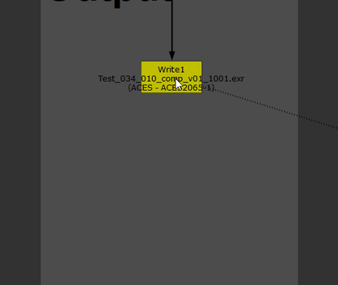
<br><br>


<br>


##  Open in Shot Player v1.01 | Lega

Abre en LGA Shot Player la media del nodo Read seleccionado.<br><br>


<br>


##  Duplicate Publish v1.0 | Lega

Para no tener que volver a renderear una secuencia entera cuando sólo cambian unos pocos frames.<br>
Con un Read seleccionado, copia su secuencia en disco renombrándola con el número de versión del script actual. Después alcanza con renderear encima únicamente el rango que cambió.<br>
Si el nombre de la secuencia no coincide con el del script, o si el destino ya tiene frames, avisa y pide confirmación antes de copiar. Y si el rango del Read no coincide con los frames que hay en disco, deja elegir entre copiar el rango del Read o el rango completo del disco. La copia corre en segundo plano con barra de progreso y se puede cancelar.

<br>


##  Write Presets v1.9 | Lega

Para crear nodos Write con configuraciones predefinidas para diferentes tipos de render.<br>
Abre una ventana con opciones de render pre configuradas que se cargan desde un archivo .ini. Permite crear Writes basados en el nombre del script o en el nombre del nodo Read más alto. Según la configuración, puede abrir un diálogo para nombrar el render y crear automáticamente un backdrop con Write y Switch. Los presets incluyen configuraciones específicas para diferentes formatos (mov, tiff, exr) con parámetros optimizados para cada caso.<br>
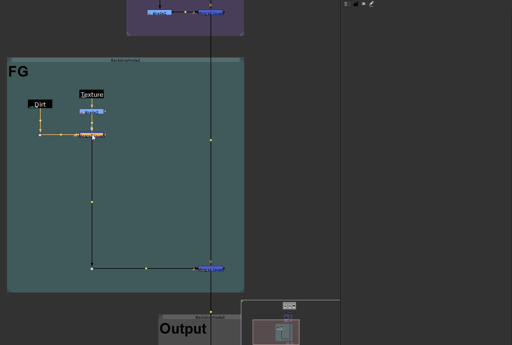

Si se ejecuta sobre un write existente se abre el editor de TLC:<br>
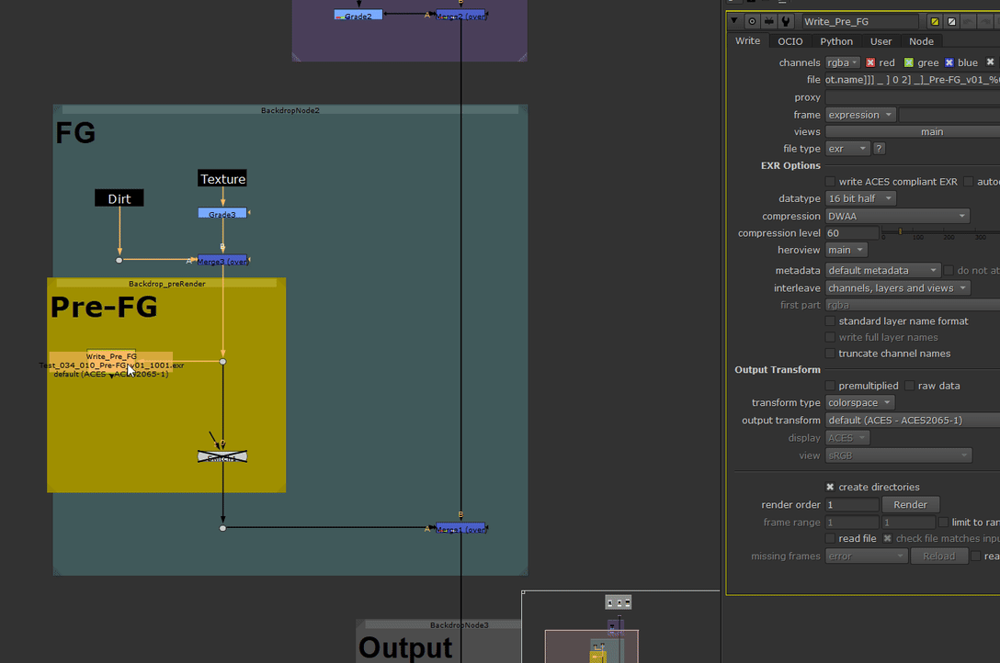
<br><br>


<br>


##  Write focus v1.0 | Lega

Para ir rápidamente al nodo Wirte principal.<br>
Busca un nodo Write con un nombre definido en los settings del ToolPack, lo pone en foco y lo abre en el panel de propiedades.
<br><br>
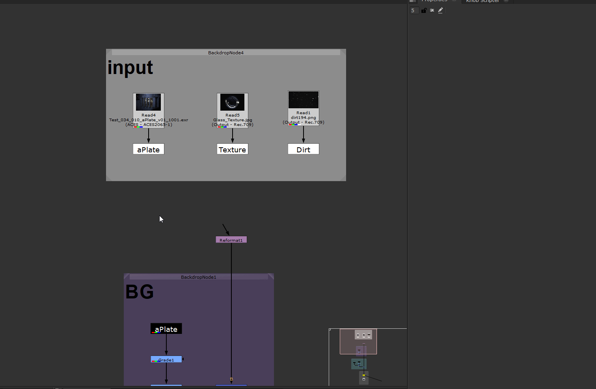
<br><br>


<br>


##  Write send mail v1.0 | Lega

Útil para renders largos, permite mandar un mail cuando termina el render.<br>
Agrega a los nodos Write seleccionados un checkbox para enviar mail. También lo agrega a cualquier nuevo nodo Write creado desde que está instalado este script.<br>
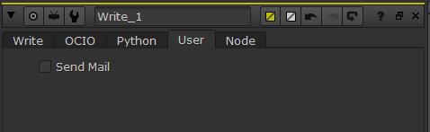<br>
La información para enviar el mail se debe completar en los settings del ToolPack.<br>
Funciona en conjunto con la herramienta Render Complete (a continuación).
<br><br>


<br>


##  Render complete v1.1 | Lega

Ejecuta las acciones siguientes cuando termina el render:

- Reproduce un sonido por defecto es un wav llamado LGA_Render_Complete.wav que está dentro de la carpeta LGA_ToolPack. Puede ser reemplazado por cualquier otro wav o deshabilitado desde los settings del ToolPack
- Calcula la duración al finalizar el render y la agrega en un knob con esa información en el tab User del nodo Write.
- Envía un email con los detalles del render si se ha creado un checkbox usando la herramienta Write send mail y si ese checkbox está activado.

<br>


##  Show in Explorer v1.0 | Lega

Revela la ubicación del archivo de un nodo Read o Write seleccionado en el Explorador de Windows. Si no hay ningún nodo seleccionado, revela la ubicación del script/proyecto actual.
<br><br>


<br>


##  Show in Flow v2.0 - 2024 | Lega

Abre la URL, revela en el internet browser la ubicación de la task comp del shot que pertenece al script/proyecto actual. Se puede elegir si hacerlo desde el browser por defecto o desde uno específico.<br>
Para el login completar la información en los settings del ToolPack.
<br><br>


<br>


##  Show Flow Notes v1.0 | Lega

Muestra en una ventana la informacion del shot y los comentarios/versiones de la task correspondiente, tomando el shot desde el nombre del script/proyecto actual de Nuke.<br>
Si el nombre del script incluye `_roto_` o `_cleanup_`, usa esa task. Si no, busca la task comp por defecto.<br>
Esta herramienta solo funciona leyendo la DB local de la app PipeSync, que es propietaria del estudio. Fuera de ese entorno no tiene datos para consultar.
<br><br>


<br>


##  RnW ColorSpace favs v1.1 | Lega

Para cambiar rapidamente el espacio de color de un Read, Write, etc.<br>
Abre una ventana con una lista de espacios de color que se pueden aplicar sobre todos los nodos Read y/o Write seleccionados.<br>
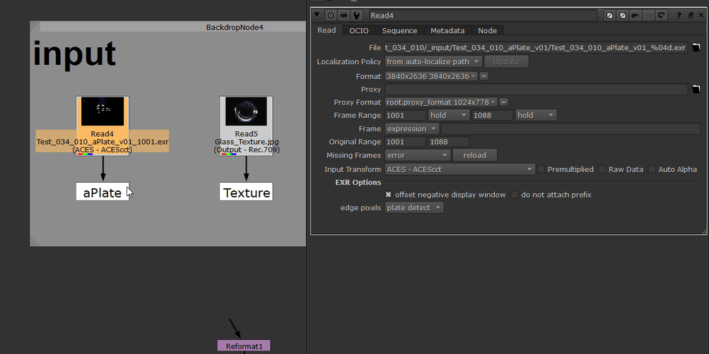<br>
Esta lista se puede editar en los settings del ToolPack.
<br><br>


<br>


<br><br>


##  Frame range | Read to Project v1.0 | Lega</strong>

Útil para cuando se empieza un proyecto nuevo y se quiere usar el frame range de un nodo Read en los settings del proyecto.
<br><br>
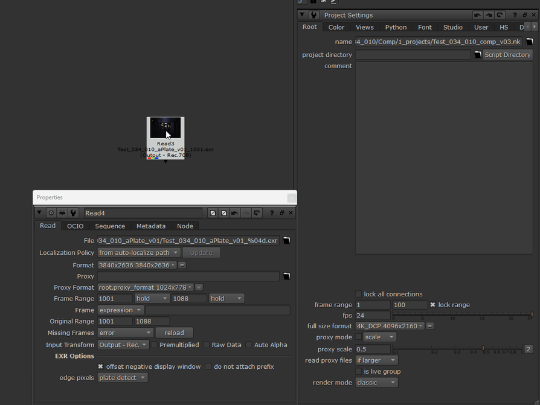
<br><br>


<br>


##  Frame range | Read to Project (+Res) v1.0 | Lega

Igual que el anterior, pero además de copiar el frame range del Read, también se copia la resolución a los settings del proyecto.
<br><br>
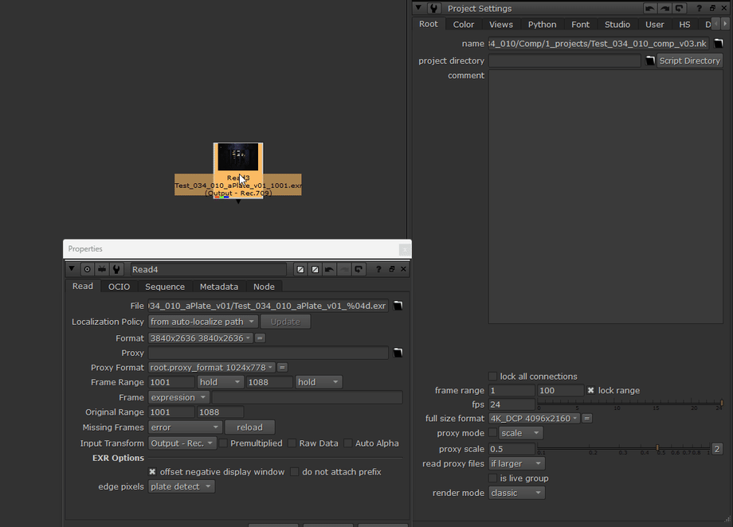
<br><br>


<br>


<br><br>


##  Rotate Transform v1.0 | Lega

Cambia los valores de rotación de los nodos Transform seleccionados.<br>
Shortcuts (usando las teclas / y * del teclado numérico):

- Ctrl + * gira 0.1 grados hacia la derecha
- Ctrl + shift + * gira 0.1 grados hacia la derecha
- Ctrl + / gira 0.1 grados hacia la izquierda
- Ctrl + shift + / gira 0.1 grados hacia la izquierda

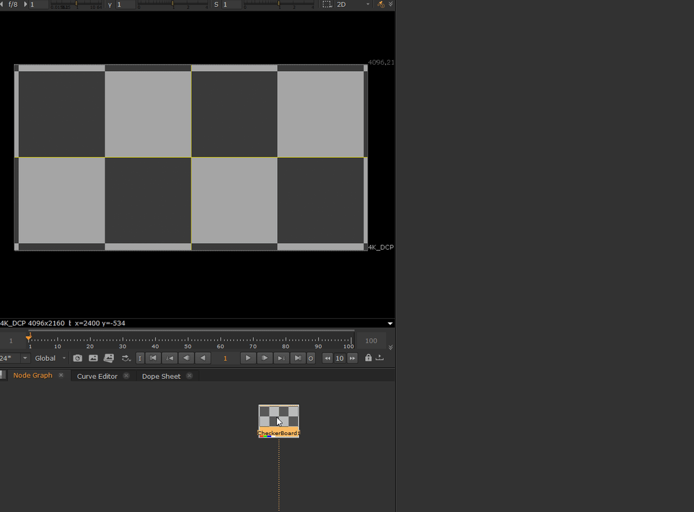

<br>


<br><br>


Esta sección es para armar setups de nodos que se usan repetidamente usando shortcuts.<br>
Similar al uso de toolSets, pero más ágil y con más posibilidades.

<br>


##  Build Iteration v1.1 | Lega

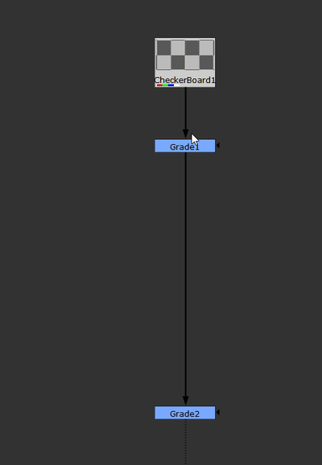
<br><br>


<br>


##  Build RotoBlur in input mask v1.1 | Lega

Agrega un nodo Roto y un Blur en el input mask del nodo seleccionado.<br>
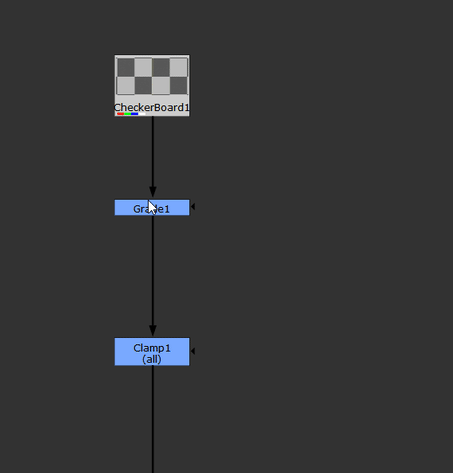
<br><br>


<br>


##  Build Merge | Switch Merge operations v1.31 | Lega

Si NO hay un nodo Merge seleccionado, crea un nodo Merge con operación en Mask y bbx en ‘A’, y en el input A suma un nodo Roto y un Blur.<br>
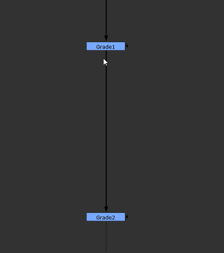<br>
Si en cambio se ejecuta con un nodo Merge seleccionado, cambia sus operaciones y va rotando entre 'over' con bbox 'B', 'mask' con bbox 'A' y 'stencil' con bbox 'B'.
<br>
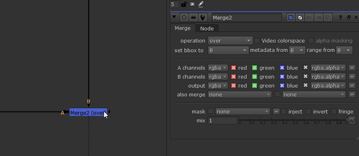
<br><br>


<br>


##  Build Grade v1.1 | Lega

Crea un nodo Grade y en el input Mask suma un nodo Roto y un Blur.<br>
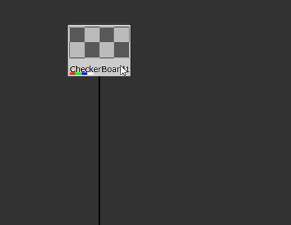
<br><br>


<br>


##  Build Grade Highlights v1.1 | Lega

Crea un nodo Grade y en el input Mask suma un nodo Keyer que sale de la rama del grade y un Shuffle para poder evaluar el canal alpha con el viewer en RGB.<br>
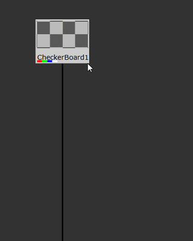
<br><br>


<br>


<br><br>


##  Channels Cycle v1.1 | Lega

Cambia el valor del knob 'channels' de un nodo seleccionado. Rota el valor entre 'rgb', 'alpha' y 'rgba'.<br>
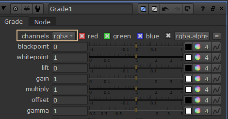
<br><br>


<br>


##  Disable A/B v1.0 | Lega

Útil para comparar rápidamente dos grupos de nodos (grupo A vs grupo B) o dos nodos iguales con distintos valores.<br>
Crea un nodo que, al habilitarlo o deshabilitarlo (shortcut D), actúa como un switch global entre un grupo y otro.<br>
Ideal para comparar, por ejemplo, dos Grades, o un blur vs un defocus, o también para crear un master switch que deshabilite nodos pesados durante el trabajo y se puedan volver a habilitar desde un solo nodo antes del render.

**Modo de uso**

Seleccionar todos los nodos que pertenecerán a ambos grupos y ejecutar la herramienta (Shift+D)<br>
Abre una ventana que muestra una lista con todos los nodos seleccionados, usando el color de cada uno, y permite seleccionar si pertenecen al grupo A o grupo B.<br>
Luego linkea el knob Disable de los nodos seleccionados a un nodo master llamado Disable_A_B para facilitar el cambio de un grupo a otro.<br>
Una vez creado el grupo, si se ejecuta Shift+D seleccionado en nodo master Disable_A_B se desconectarán y volverá todo a su estado inicial.<br>
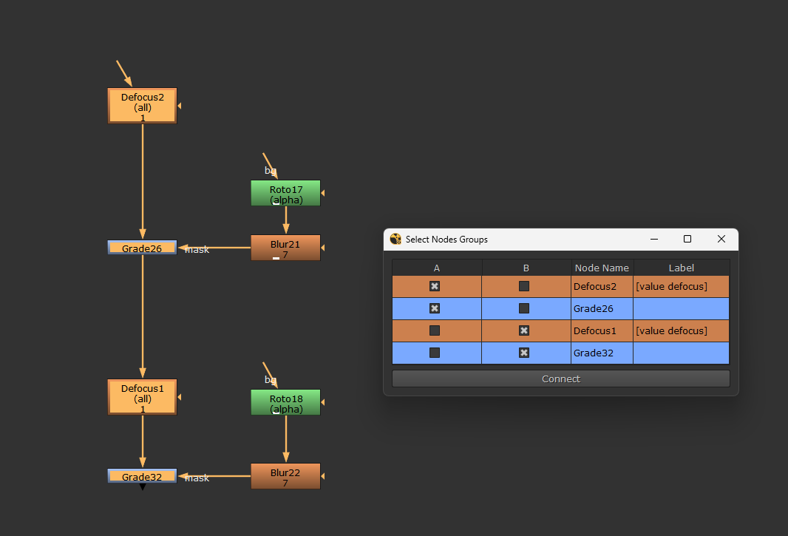
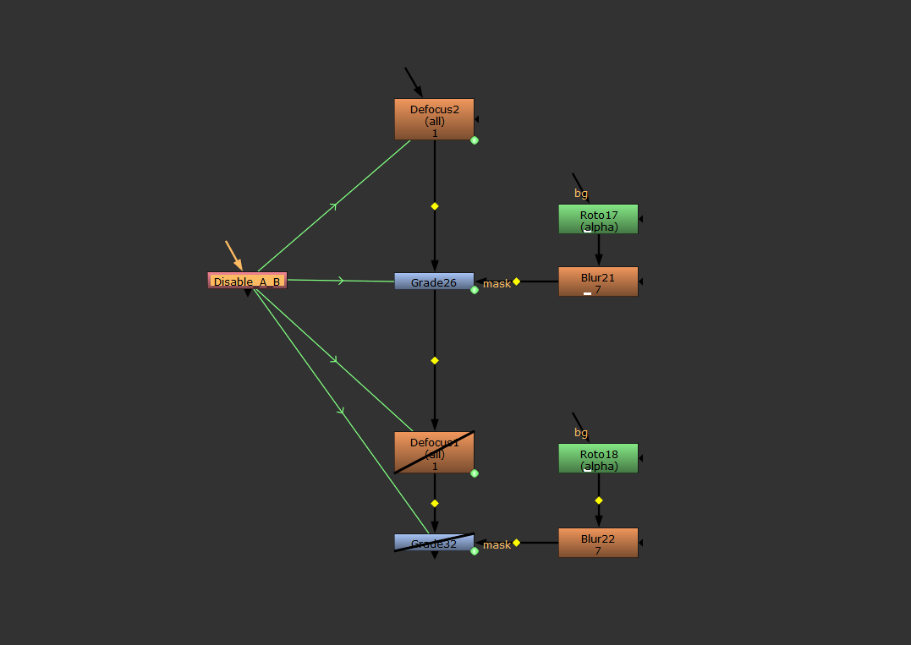
<br><br>


<br>


##  Channel Hotbox v2.0 | Falk Hofmann

[http://www.nukepedia.com/python/ui/channel-hotbox](http://www.nukepedia.com/python/ui/channel-hotbox)<br>
Abre una GUI que permite cambiar fácilmente los canales actualmente disponibles del viewer (rgba, depth, motion, AOVs, etc, evitando el menú desplegable, page up/down.<br>
También permite mostrar, shufflear o aplicar un grade a los canales disponibles en el nodo al que está conectado el Viewer actual.<br>
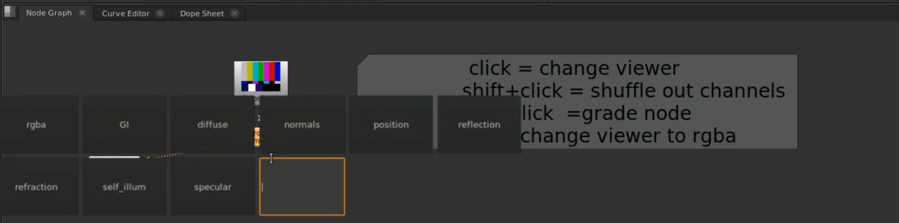


**Shortcuts**
Shift + H Abre la GUI<br>
Shortcuts con la GUI abierta:
- Click Cambia el visor al canal seleccionado.
- Shift+Click Shufflea todos los canales seleccionados.
- Ctrl+Click Crea un nodo Grade con el canal configurado al seleccionado.
- Alt Cambia el visor de vuelta a RGBA.

<br>


<br><br>


##  Viewer Rec709 v1.0 | Lega</strong>

Cambia el viewer a Rec709.
<br><br>


<br>


##  Take/Show Snapshot v1.07 | Lega</strong>

Take: Toma un snapshot (jpg) de lo que se ve en el viewer —con el viewerProcess, el gain y el gamma aplicados, y respetando el encuadre—, lo copia al portapapeles, lo guarda en la carpeta de archivos temporales y también en una galería.<br>
Take and append: Con Shift se generan dos imágenes: la captura suelta y la compo con la anterior pegada a su izquierda. Repitiendo el shortcut se va armando la tira de comparación —plate, versión del vendor, propuesta— sin pasar por Photoshop.<br>
Show: Muestra el último snapshot tomado, el de la carpeta de archivos temporales.<br>
Además de los shortcuts en el menú, también se agregan estos botones al viewer:<br>
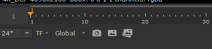

El último botón abre una galería con todos los snapshots que se guardan, separados por proyecto. Sobre cada thumbnail: click para abrirlo en el visor por defecto, Shift+click para abrirlo en el ShareX Image Editor —opción que aparece sólo si están instaladas las HieroTools—, y Alt+click para revelarlo en el explorador:<br>
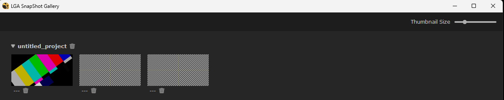
<br><br>
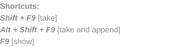

<br>


##  Reset workspace v1.0 | Checho

Reinicia el workspace.
<br><br>


<br>


##  Restart NukeX v1.12 | Lega</strong>

Reinicia NukeX. Antes de hacerlo espera a que se guarde o no el proyecto actual, busca cual es la versión actual de Nuke abierta y lo reinicia usando la misma consola que se estaba usando.<br>
Útil cuando borrar la caché no es suficiente para que Nuke vuelva a funcionar correctamente y es necesario cerrarlo y volver a abrirlo.
<br><br>


<br>
