<p align="right"><b>English</b> · <a href="README_ES.md">Español</a></p>

<p>
  
  <span style="font-size:1.6em;font-weight:700;line-height:1;">LGA TOOL PACK</span><br>
  <span style="font-style:italic;line-height:1;">Lega | v2.65</span><br>
</p>
<br clear="left">

**What's new:** [Releases](https://github.com/legandrop/LGA_ToolPack-for_Nuke/releases)

## Installation

- Copy the **LGA_ToolPack** folder, which contains all the ToolPack files, to **%USERPROFILE%/.nuke**.<br> It should end up like this:
   ```
   .nuke/
   └─ LGA_ToolPack/
      ├─ menu.py
      ├─ py/
      └─ ...
  ```

- With a text editor, add this line of code to the
  **init.py** file inside the **.nuke** folder:

  ```
  nuke.pluginAddPath('./LGA_ToolPack')
  ```

- The pack lets you **enable/disable** tools from the **TP > Enable Tools** menu, explained below.

<br>


## Enable Tools v1.06 | Lega

To choose which of the pack's tools show up in the menu.<br>
Open it from **TP > Enable Tools**. It shows one checkbox per tool, grouped the same way as the menu. A tool you uncheck is hidden from the menu and is also **not loaded**, so turning off what you don't use also takes some work off Nuke's startup. Changes take effect when you restart Nuke.<br>
Your choice is saved **outside the pack**, in **%APPDATA%\LGA\ToolPack\Enabled.ini** (Windows) or **~/Library/Application Support/LGA/ToolPack/Enabled.ini** (macOS), so updating the pack doesn't overwrite it. The file path is shown at the very bottom and you can click it to open it in the file browser.<br>
**All On** and **All Off** check and uncheck everything; **Reset** goes back to the factory defaults, which you still have to save with **Save**.

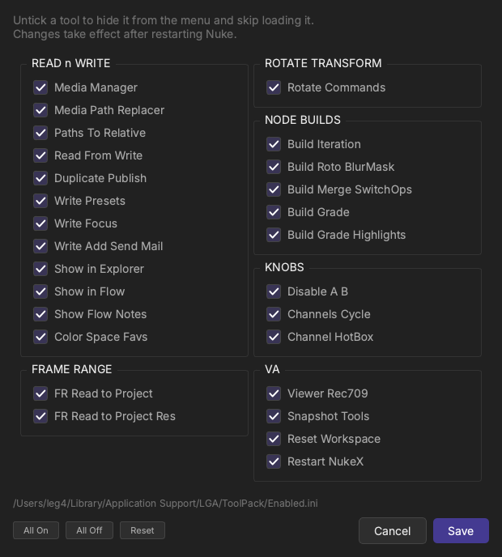

<br>


<br><br>


##  Media manager v2.59 | Lega

To quickly review and organize all of the project's media.<br>
When run, it scans the folders configured as scan locations and every path in the script's Read nodes, showing the status of each file as OK, Offline, Outside or Unused so you can decide whether to relink, copy or delete.<br><br>


**Functions**
- <strong>Go to read:</strong> (Alt+G) Shows in the node graph the Read that holds the selected media.
- <strong>Reveal:</strong> (Alt+R) Opens the media's folder in the system file browser.
- <strong>Relink:</strong> (Alt+L) Opens a window to choose a location to search for a file that is marked as offline. It searches the folder and its subfolders until it finds a match, and changes the Read's path to the path it found. The browser opens in the <strong>last folder you used</strong>, even if that was in another session; if that folder no longer exists, it goes up one level at a time until it reaches the first one that does.
- <strong>Copy to:</strong> (Alt+C) Copies the selected media to the chosen destination and changes the Read's path to the path where it was copied. Only enabled for files marked as Outside. The destinations in the menu are the locations that have <em>Copy to</em> checked in the Settings, in that order, and each one is triggered with Alt + the letter of its shortcut. If a destination's path has a wildcard and resolves to no folder or to several, it warns you and doesn't copy: picking one would be guessing.
- <strong>Download:</strong> (Alt+D) Requests from Wasabi the file or sequence of each selected row: the same path the row shows, without looking for higher versions. It does this through FileManager S3 or, if that isn't installed, through PipeSync, which accepts the same command; the button only appears if either of the two is available. You follow the download from that app's Activity tab, and when it finishes a Rescan updates the table.
- <strong>Delete:</strong> (Alt+Backspace) Sends the selected files to the trash. Works with multiple row selection.
- <strong>Reload All Reads:</strong> Bottom right, to the left of <em>Rescan</em>. Tells Nuke to reload from disk every node that reads files —anything with a <em>Reload</em> button in its properties, not just Reads— and then scans again. Useful when a render has finished and the Read is still showing the old cache, or when the missing frames are now there and the node still reports them as absent.
- <strong>Collect:</strong> Copies the script and all the media it uses to a new folder, and <strong>recreates the shot structure there</strong>: the same folders that define the Shot folder and the Scan locations in the Settings, with the <code>.nk</code> in the same relative position. That way the collected script resolves its own shot and its own locations, and opening the Media Manager on it reads the collect and not the original shot. It is the only button that doesn't work on the selection but on the entire script, which is why it sits apart and has no shortcut.<br>
You choose the <strong>parent folder</strong> and Collect creates the folder named after the shot inside it; if the one you chose already has that name, it uses it as is. The browser opens in the <strong>last folder you collected to</strong>, even if that was in another session; if it no longer exists it opens in the <code>.nk</code>'s folder —unlike Relink, it doesn't go up a level, because going up from an old delivery leads to the deliveries of another project—. All the shot's folders are created, whether they have content or not, so the result is a complete shot. Whatever lives <em>outside</em> the shot goes to the <em>Input</em> location, keeping its source folder; the confirmation dialog tells you which one before you accept. If the Shot folder is turned off there is no structure to recreate, and in that case it groups by location name and tells you so.<br>
Writes are repointed but not copied, because their file is an output. A CopyCat's <code>dataDirectory</code> is recreated empty: inside it live the training contact sheets and the alternate checkpoints, which are process history and not comp material; the <code>.cat</code> the node uses and the one an Inference evaluates are copied. Knobs with TCL expressions are left untouched, because an expression built on <code>nuke.script_directory()</code> already follows the script on its own.<br>
It's best to have the script saved before you start. If something fails it rolls back instead of leaving the script half done: cancelling the copy doesn't rewrite any path, a file that couldn't be copied keeps its node pointing to the original, and if the save fails the entire rewrite is undone. The only thing it rejects is a destination where the collected script would land on top of the original.
<br><br>

**Options available in the Settings**

- <strong>Shot folder:</strong> The main shot folder, written as a path relative to the script's folder. It defines what is inside the shot and what is outside, that is, where the Outside status comes from, and it is the anchor for path coloring. The default is <code>../..</code>: if the script is in T:/Client/Film/Shot/Comp/Project/e101s005.nk, it goes up from Project to Comp and from Comp to Shot. It can be turned off, and then Outside is measured against the scan locations instead.
- <strong>Scan locations:</strong> One row per folder, with its name and its path relative to the script. The path accepts <code>*</code> as a wildcard, so <code>../*assets*</code> finds 0_assets, _assets or my_assets without having to type the exact name, and the <em>Resolves to</em> column shows which real folder each one points to. Each row has two checkboxes: <strong>Scan</strong> includes it in the scan —if another location already contains it, it stays checked and disabled, because the scan is recursive— and <strong>Copy to</strong> offers it in the copy menu. If no location exists next to the script —a loose <code>.nk</code> on the desktop, for example— no folder is scanned and the table shows only the files used by the script's nodes. The shortcut goes in its own field, a single letter, and is triggered with Alt + that letter.
<br>

**The status bar**

Below the buttons, the pills count how many files there are of each status out of the total, unaffected by the search box. On the right, set off by a divider, it shows the <strong>free space on the drive where the script lives</strong> —for example <code>700 GB free on N:</code>, with the size and the drive letter highlighted—, which is where everything copied with Copy to or Collect ends up. It comes with a colored dot that uses the same language as the pills: <strong>green</strong> from 200 GB up, <strong>yellow</strong> between 100 and 200, and <strong>red</strong> below 100. If that value can't be read, the label and its dot simply don't appear.
<br><br>

**Options available in the Settings (continued)**

- <strong>Theme and Table font size:</strong> The palette of both windows and the font size of the tables. Both are shown applied as you pick them, and Cancel reverts them.
<br><br>

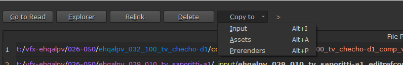
<br><br>


<br>


##  Media path replacer v2.03 | Lega

For when there is missing media because the project and its media were moved.<br>
Lets you search and replace paths in Read and Write nodes. Includes a preview in double rows (Original/New) with visual identification by node type, two Search & Replace stages and built-in presets.<br>
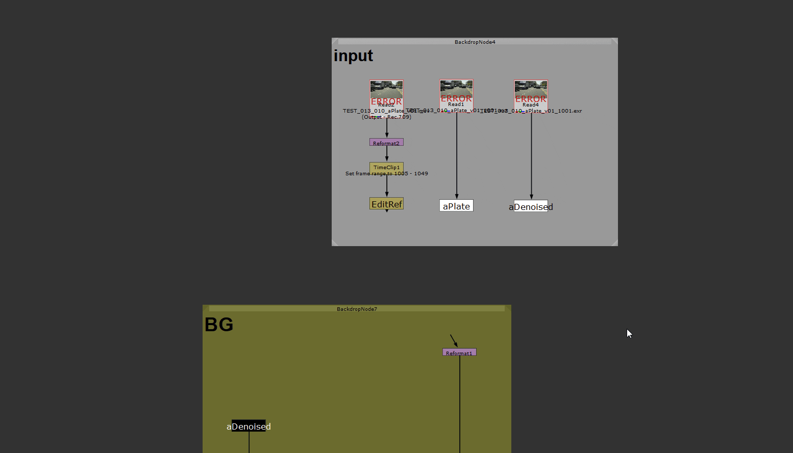<br>
Useful for updating file paths when projects are moved to other folders or drives.
<br><br>


<br>


##  Paths to Relative v1.04 | Lega

So the project survives a change of drive or location.<br>
Converts the absolute paths of nodes that point to files into relative paths: Read, Write, DeepRead, DeepWrite, ReadGeo, WriteGeo, Precomp, Vectorfield and OCIOFileTransform, including the `proxy` knob.<br>
Paths are calculated against the **Project Directory** in Project Settings, which is what Nuke resolves relative paths against. Watch out for this: it does not resolve them against the location of the `.nk`. If that field is empty, relative paths don't work, so the window offers to set it to `[python {nuke.script_directory()}]`, the same expression the Script Directory button sets.<br>
If nodes are selected it acts only on those; otherwise it goes through the whole script. It goes into Groups, but not inside Precomps, because their internal nodes come from another `.nk`.<br>
Before modifying anything it opens a preview table with a checkbox per row, a column for the Group each node lives in, and colors: green for convertible, yellow when the path goes up many levels, red when the media is on another drive and no relative path is possible.<br>
Knobs with TCL expressions, such as Writes created with Write Presets, are never touched. The entire change is applied in a single undo step.

<br>


##  Read from Write v2.3 | Fredrik Averpil

[https://www.nukepedia.com/python/misc/readfromwrite](https://www.nukepedia.com/python/misc/readfromwrite)<br>
Creates a Read node from the path and file of the selected Write node.
<br><br>
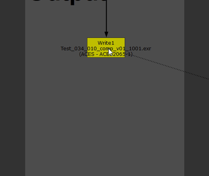
<br><br>


<br>


##  Open in Shot Player v1.01 | Lega

Opens in LGA Shot Player the media of the selected Read node.
<br><br>


<br>


##  Duplicate Publish v1.0 | Lega

So you don't have to re-render a whole sequence when only a few frames change.<br>
With a Read selected, it copies its sequence on disk, renaming it with the version number of the current script. After that it's enough to render over only the range that changed.<br>
If the sequence name doesn't match the script's name, or if the destination already has frames, it warns you and asks for confirmation before copying. And if the Read's range doesn't match the frames on disk, it lets you choose between copying the Read's range or the full range on disk. The copy runs in the background with a progress bar and can be cancelled.

<br>


##  Write Presets v2.78 | Lega

To create Write nodes with predefined settings for different kinds of renders.<br>
Opens a window with preconfigured render options that are loaded from an .ini file. It lets you create Writes based on the script name or on the name of the topmost Read node. Depending on the configuration, it can open a dialog to name the render and automatically create a backdrop with a Write and a Switch. The presets include specific settings for different formats (mov, tiff, exr) with parameters tuned for each case.<br>
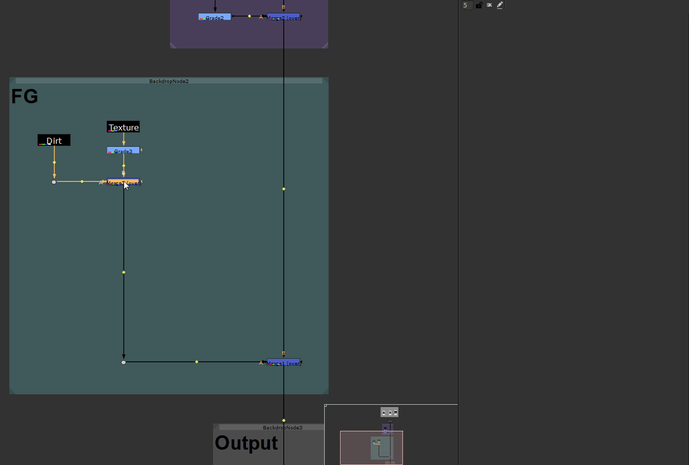

If run on an existing Write, the TCL editor opens:<br>
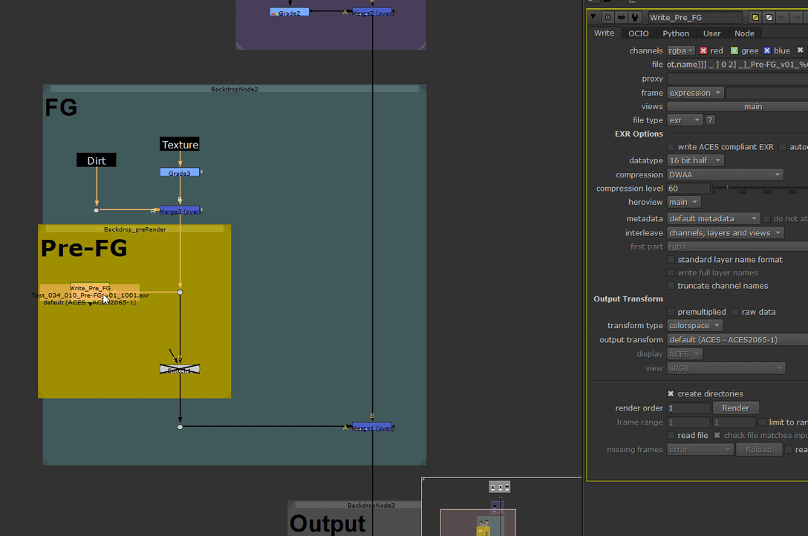

You can also save your own presets: select a Write and the nodes above it (color transforms, burn-ins, groups, even the backdrop around them) and press Alt+Shift+W. The preset appears at the end of the list as [Chain], and clicking it pastes the whole chain under the selected node. When saving, the Write's frame range is removed, and if there are absolute paths, such as a LUT, it offers to make them relative to the script. Right-click a [Chain] preset to move it to the trash.
<br><br>


<br>


##  Write focus v1.0 | Lega

To jump quickly to the main Write node.<br>
Finds a Write node with a name defined in the ToolPack settings, focuses it and opens it in the properties panel.
<br><br>
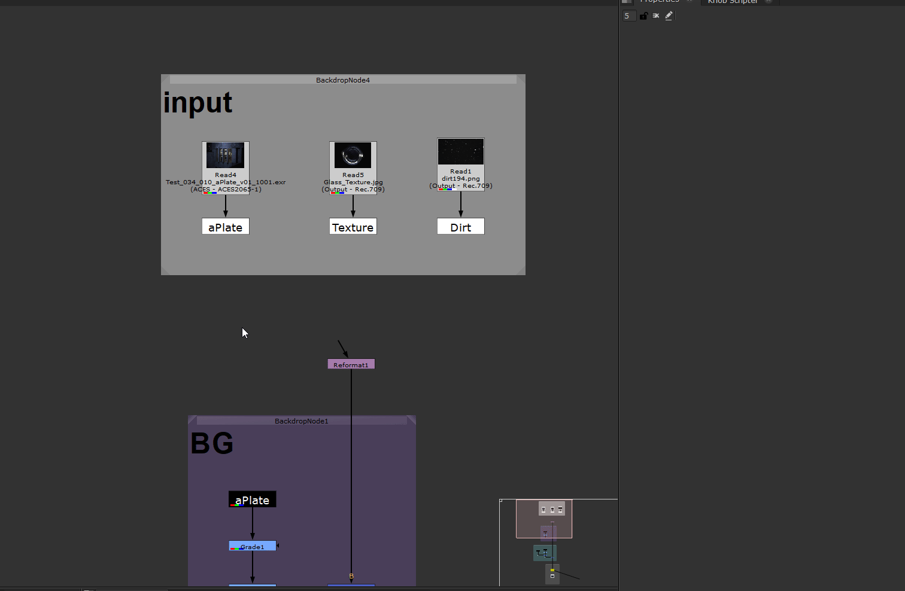
<br><br>


<br>


##  Write send mail v1.0 | Lega

Useful for long renders: lets you send an email when the render finishes.<br>
Adds a send-email checkbox to the selected Write nodes. It also adds it to any new Write node created since this script was installed.<br>
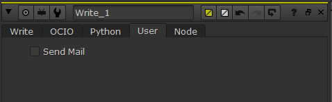<br>
The information needed to send the email must be filled in in the ToolPack settings.<br>
Works together with the Render Complete tool (below).
<br><br>


<br>


##  Render complete v1.1 | Lega

Runs the following actions when the render finishes:

- Plays a sound. By default it is a wav called LGA_Render_Complete.wav inside the LGA_ToolPack folder. It can be replaced with any other wav or disabled from the ToolPack settings
- Calculates the duration when the render finishes and adds it to a knob with that information in the User tab of the Write node.
- Sends an email with the render details if a checkbox was created using the Write send mail tool and that checkbox is enabled.

<br>


##  Show in Explorer v1.0 | Lega

Reveals the file location of a selected Read or Write node in Windows Explorer. If no node is selected, it reveals the location of the current script/project.
<br><br>


<br>


##  Show in Flow v2.0 - 2024 | Lega

Opens the URL, revealing in the web browser the location of the comp task for the shot that the current script/project belongs to. You can choose whether to use the default browser or a specific one.<br>
For the login, fill in the information in the ToolPack settings.
<br><br>


<br>


##  Show Flow Notes v1.0 | Lega

Shows in a window the shot information and the comments/versions of the corresponding task, taking the shot from the name of the current Nuke script/project.<br>
If the script name includes `_roto_` or `_cleanup_`, it uses that task. Otherwise it looks for the comp task by default.<br>
This tool only works by reading the local DB of the PipeSync app, which is proprietary to the studio. Outside that environment it has no data to query.
<br><br>


<br>


##  RnW ColorSpace favs v1.1 | Lega

To quickly change the color space of a Read, Write, etc.<br>
Opens a window with a list of color spaces that can be applied to all the selected Read and/or Write nodes.<br>
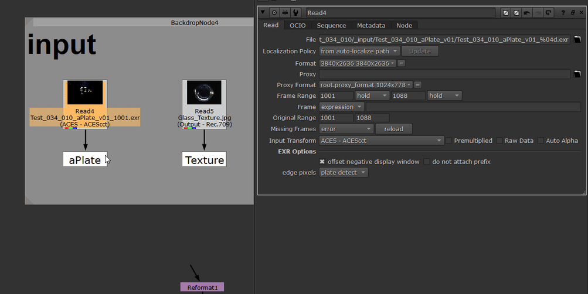<br>
This list can be edited in the ToolPack settings.
<br><br>


<br>


<br><br>


##  Frame range | Read to Project v1.0 | Lega</strong>

Useful when you start a new project and want to use a Read node's frame range in the project settings.
<br><br>
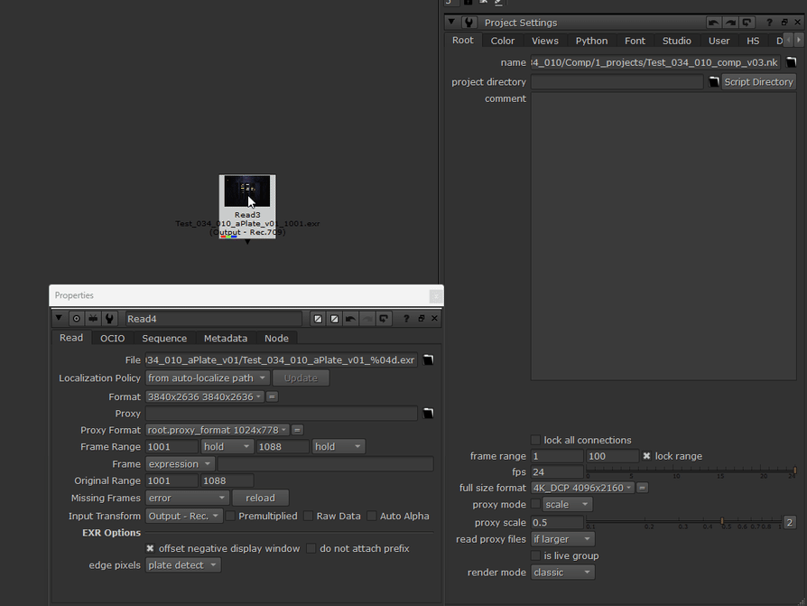
<br><br>


<br>


##  Frame range | Read to Project (+Res) v1.0 | Lega

Same as the previous one, but besides copying the Read's frame range, it also copies the resolution to the project settings.
<br><br>
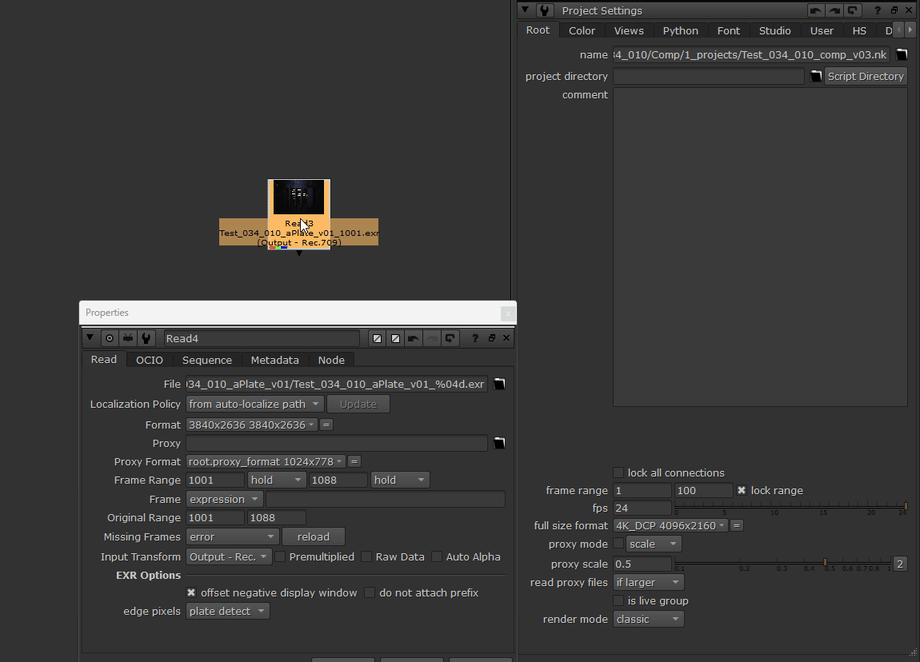
<br><br>


<br>


<br><br>


##  Rotate Transform v1.0 | Lega

Changes the rotation values of the selected Transform nodes.<br>
Shortcuts (using the / and * keys on the numeric keypad):

- Ctrl + * rotates 0.1 degrees clockwise
- Ctrl + shift + * rotates 0.1 degrees clockwise
- Ctrl + / rotates 0.1 degrees counterclockwise
- Ctrl + shift + / rotates 0.1 degrees counterclockwise

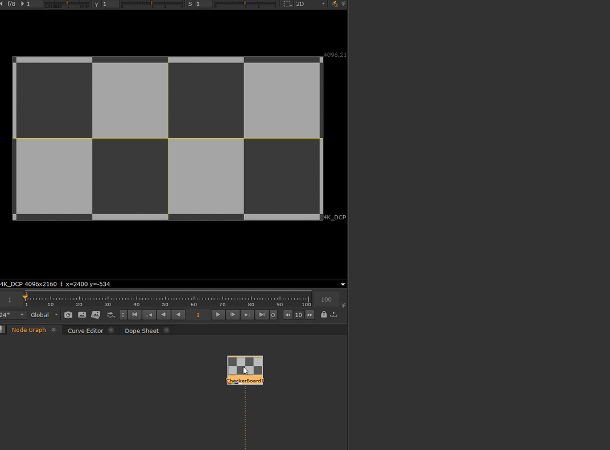

<br>


<br><br>


This section is for building node setups that get used over and over, using shortcuts.<br>
Similar to using toolSets, but faster and with more possibilities.

<br>


##  Build Iteration v1.1 | Lega

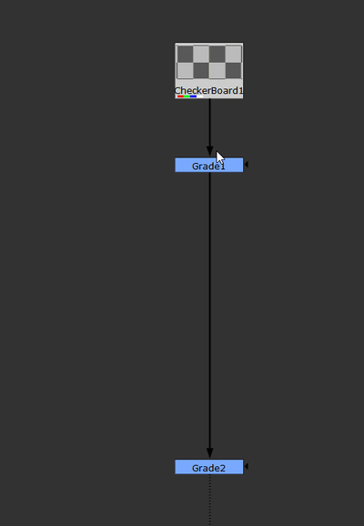
<br><br>


<br>


##  Build RotoBlur in input mask v1.1 | Lega

Adds a Roto node and a Blur to the mask input of the selected node.<br>
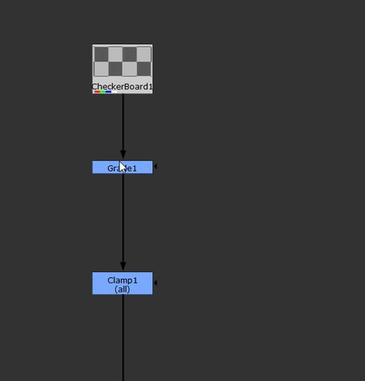
<br><br>


<br>


##  Build Merge | Switch Merge operations v1.31 | Lega

If NO Merge node is selected, it creates a Merge node with the operation set to Mask and bbox set to ‘A’, and adds a Roto node and a Blur on the A input.<br>
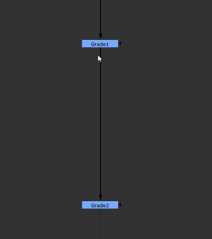<br>
If instead it is run with a Merge node selected, it changes its operations, cycling through 'over' with bbox 'B', 'mask' with bbox 'A' and 'stencil' with bbox 'B'.
<br>
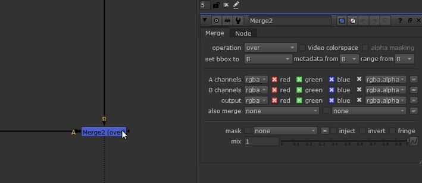
<br><br>


<br>


##  Build Grade v1.1 | Lega

Creates a Grade node and adds a Roto node and a Blur on the Mask input.<br>
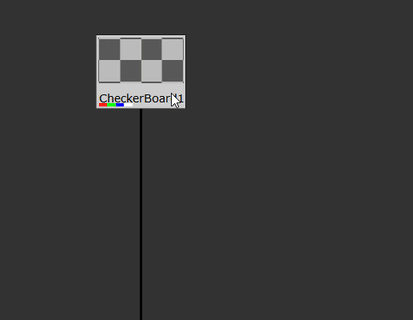
<br><br>


<br>


##  Build Grade Highlights v1.1 | Lega

Creates a Grade node and, on the Mask input, adds a Keyer node branching off the grade and a Shuffle so you can check the alpha channel with the viewer set to RGB.<br>
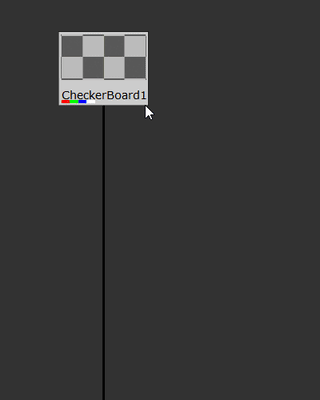
<br><br>


<br>


<br><br>


##  Channels Cycle v1.1 | Lega

Changes the value of the 'channels' knob of a selected node. Cycles the value between 'rgb', 'alpha' and 'rgba'.<br>
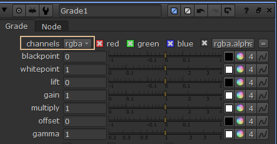
<br><br>


<br>


##  Disable A/B v1.0 | Lega

Useful for quickly comparing two groups of nodes (group A vs group B) or two identical nodes with different values.<br>
Creates a node that, when enabled or disabled (shortcut D), acts as a global switch between one group and the other.<br>
Ideal for comparing, for example, two Grades, or a blur vs a defocus, or also for creating a master switch that disables heavy nodes while you work and that can be re-enabled from a single node before rendering.

**How to use**

Select all the nodes that will belong to both groups and run the tool (Shift+D)<br>
It opens a window showing a list of all the selected nodes, using each one's color, and lets you choose whether each belongs to group A or group B.<br>
It then links the Disable knob of the selected nodes to a master node called Disable_A_B, to make switching from one group to the other easy.<br>
Once the group is created, running Shift+D with the Disable_A_B master node selected will disconnect them and everything goes back to its initial state.<br>
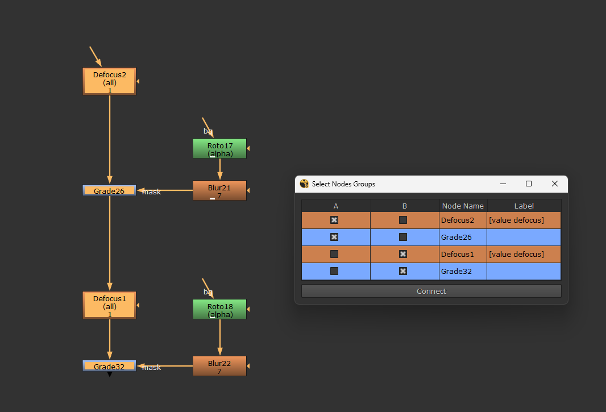
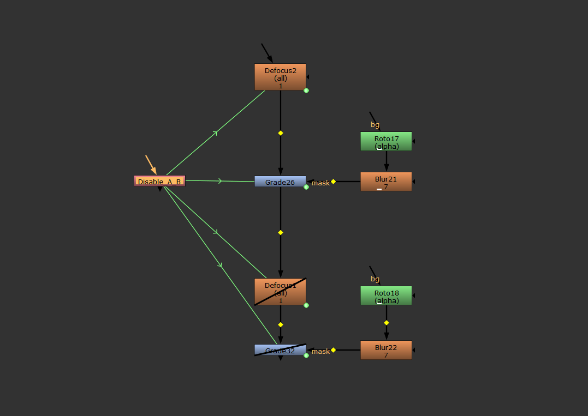
<br><br>


<br>


##  Channel Hotbox v2.0 | Falk Hofmann

[http://www.nukepedia.com/python/ui/channel-hotbox](http://www.nukepedia.com/python/ui/channel-hotbox)<br>
Opens a GUI that lets you easily switch between the channels currently available in the viewer (rgba, depth, motion, AOVs, etc.), avoiding the dropdown menu and page up/down.<br>
It also lets you view, shuffle or apply a grade to the channels available in the node the current Viewer is connected to.<br>
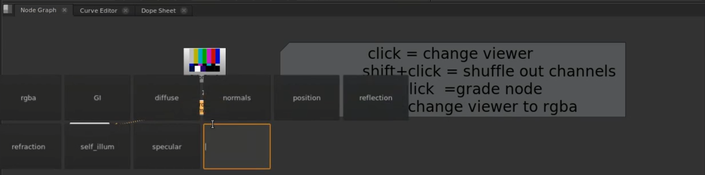


**Shortcuts**
Shift + H Opens the GUI<br>
Shortcuts with the GUI open:
- Click Switches the viewer to the selected channel.
- Shift+Click Shuffles all the selected channels.
- Ctrl+Click Creates a Grade node with its channel set to the selected one.
- Alt Switches the viewer back to RGBA.

<br>


<br><br>


##  Viewer Rec709 v1.0 | Lega</strong>

Switches the viewer to Rec709.
<br><br>


<br>


##  Take/Show Snapshot v1.09 | Lega</strong>

Take: Takes a snapshot (jpg) of what you see in the viewer —with the viewerProcess, gain and gamma applied, and respecting the framing—, copies it to the clipboard, saves it in the temp files folder and also in a gallery.<br>
Take and append: With Shift, two images are generated: the standalone capture and a composite with the previous one attached to its left. Repeating the shortcut builds up a comparison strip —plate, vendor version, proposal— without going through Photoshop.<br>
Show: Shows the last snapshot taken, the one in the temp files folder.<br>
Besides the shortcuts in the menu, these buttons are also added to the viewer:<br>
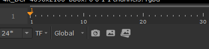

The last button opens a gallery with all the saved snapshots, separated by project. On each thumbnail: click to open it in the default viewer, Shift+click to open it in FrameRev to annotate it —an option that only appears if FrameRev 0.265 or later is installed—, and Alt+click to reveal it in the file browser:<br>
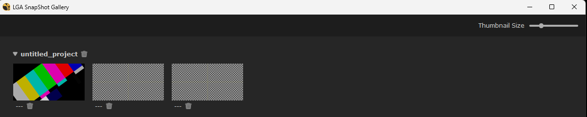
<br><br>
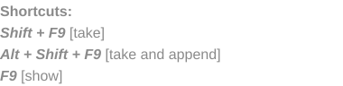

<br>


##  Reset workspace v1.0 | Checho

Resets the workspace. It's the only tool in the pack that is also in Hiero and Nuke Studio, in its own TP menu and with the same shortcut.
<br><br>


<br>


##  Restart NukeX v1.12 | Lega</strong>

Restarts NukeX. Before doing so, it waits for you to save or not save the current project, finds which version of Nuke is currently open and restarts it using the same console that was being used.<br>
Useful when clearing the cache isn't enough to get Nuke working properly again and you need to close it and reopen it.
<br><br>


<br>
